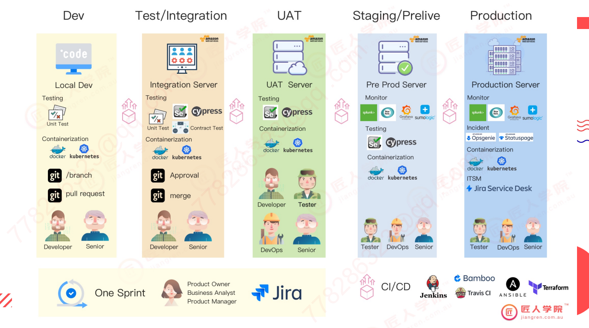
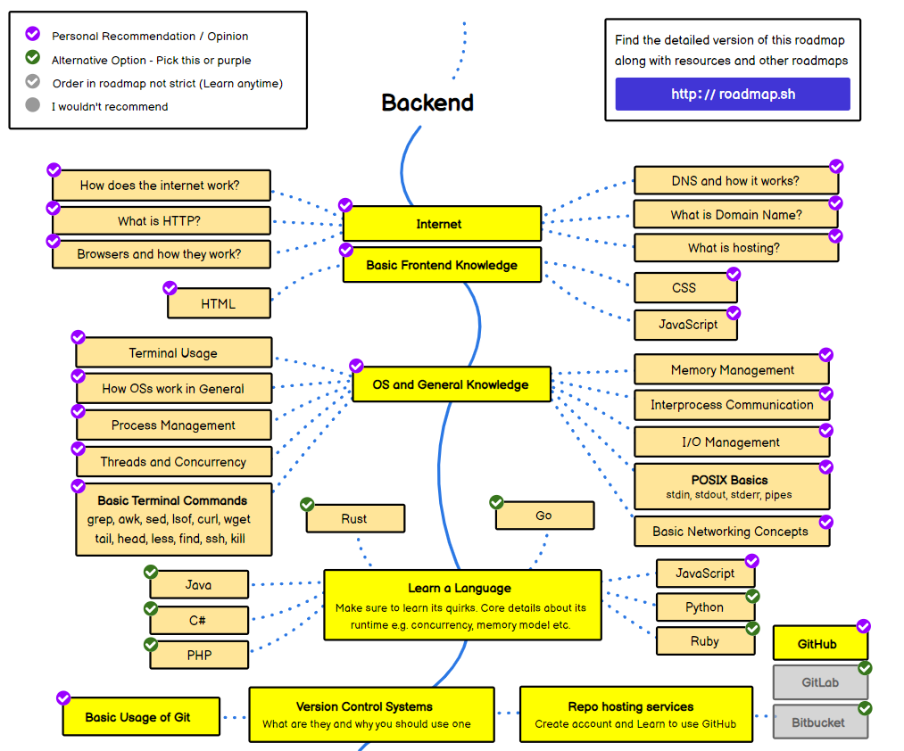
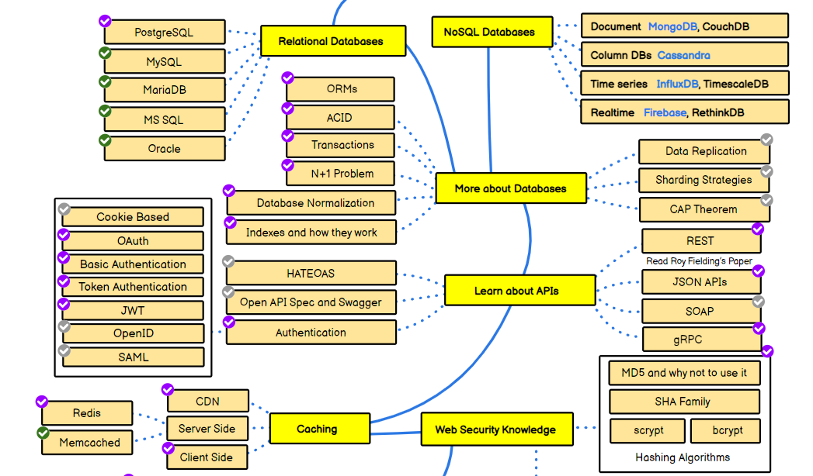
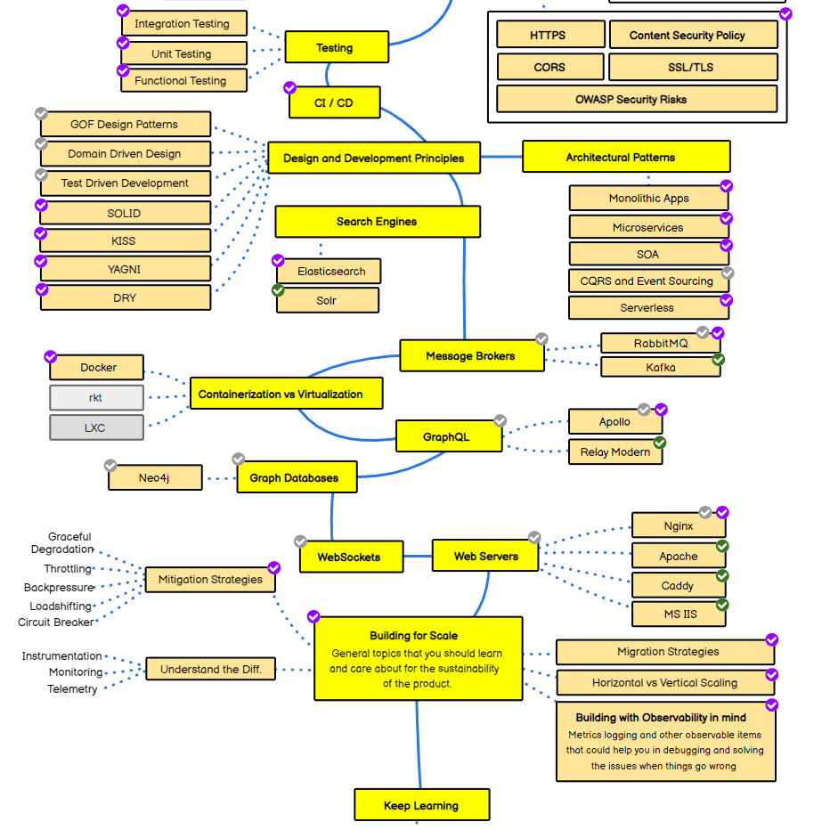

# Java_Part_1

## Table of Content

- [Java 基础](#java-基础)
- [后端开发路线图](#后端开发路线图)
- [Java 介绍](#java-介绍)
- [Java 语法](#java-语法)

## Java 基础

### 什么是后端开发？

- 后端开发指在服务器端进行的软件开发，关注网站背后不可见的部分。后端开发人员确保网站正常运行，主要涉及数据库、后端逻辑、应用程序编程接口（API）、架构和服务器。他们编写的代码帮助浏览器与数据库通信、存储、读取和删除数据。

- 后端开发偏向逻辑，而逻辑在不同环境下可能有不同的表现，这意味着程序在不同环境下运行时可能会遇到问题。

  - 建议：
    - 了解生产环境如何部署、如何查看日志、如何确保其正常运行（可以请教 DevOps 同事）。
    - 熟悉生产环境或 UAT 环境，尊重生产环境。
    - 重要：项目开发要求了解不同的隔离环境，了解 CI/CD 流水线（如 Jenkins）如何一步步部署，如何登录生产环境，如何进行故障排除，知道数据库位置、生产运行环境位置、缓存部署等。
      

## 后端开发路线图

- [文章版](https://www.geeksforgeeks.org/back-end-developer-roadmap-2022/)
- [图片版](https://roadmap.sh/backend)



- **互联网部分**

  - HTTP 的工作原理？面试中常问 HTTP 的 GET 和 POST 的区别。
  - 如何设计一个好的 REST API？
  - 域名在项目中会用到，需了解如何处理。
  - 了解 Hosting 即可。
  - HTML、CSS 和 JavaScript 是必备技能。

- **操作系统部分**

  - Java 开发的环境多为 Linux，因此需掌握部分终端命令。
  - 需要掌握基本的终端命令。
  - 了解 shell 脚本即可，不需特别关注。

- **版本控制部分**

  - 清楚版本控制的概念，了解应在版本控制中包含的内容，如 `.gitignore`、流水线相关文件、脚本、Dockerfile 等。
  - 例如，Java 项目中只应包含源代码，构建过程中生成的 `.class` 和 `.jar` 文件应排除。如果依赖管理和代码维护得当，使用相同的 JDK 和 Gradle 可以生成相同的类文件。
    

- **数据库部分**

  - NodeJS 常用 NoSQL，而 Java 常用关系型数据库，我们的课程将以 PostgreSQL 为例。
  - 数据库的 ORMs、ACID、事务、N+1 问题等都很重要，数据库规范化和索引是基础知识。

- **API 部分**

  - 主要涉及 REST API，也会涉及一些 JSON API。
  - 认证和加密相关的内容在安全课程中不会详细讲解，了解项目中的应用即可。
    

- **测试部分**

  - 我们会涉及集成测试、单元测试和功能测试。
  - 测试驱动开发（TDD）参考作业。
  - 强调：没有测试用例的保障，代码无法保证质量，修改难度大。

- **CI/CD 部分**

  - 不要求编写 CI/CD 流水线，但需了解每个步骤的作用，清楚流程。

- **设计和开发原则部分**

  - SOLID 原则：
    - 单一职责
    - 开闭原则
    - 里氏替换原则
    - 接口隔离原则
    - 依赖反转原则
  - KISS 原则：保持简单
  - YAGNI 原则：你不会需要它
  - DRY 原则：不要重复自己
  - 关注点分离：将程序分成独立的部分，每个部分解决不同的关注点

- **架构模式部分**

  - 我们会在最后一节课讲解微服务的使用和定义。
  - 对初级职位要求不高。

- **搜索引擎和消息代理部分**

  - 我们基本不涉及。

- **容器化与虚拟化部分**

  - Docker 是必备技能，通常用于将后端部署到 AWS 上。

- **GraphQL 部分**

  - 简单涉及。

- **不会涉及的部分**
  - 图数据库和 Websockets、Web 服务器。
  - 为扩展规模的开发内容。

## Java 介绍

### Java 历史

**两个优点**

1. 写一次，到处运行（运行在 JVM 上）
2. 垃圾回收避免了内存泄漏（但如果编写不当仍会有内存泄漏）

**Java 8 - Java 17 改进**

### Java 路线图


- 多线程在澳洲求职和实际使用中出现频率不高。

- 常用场景包括：
  - 流处理、集合、序列化、构建工具、Spring、Spring Boot、日志（帮助调试的日志）

### 开发环境

**Java 17**

本课程使用的版本。

**IntelliJ IDEA**

使用 Analyze -> Inspect Code 检查代码。

**Google Java Style Guide**

用于格式化代码。

### Java 的工作原理

源码 -> Java 编译器 -> 字节码 -> Java 虚拟机（JVM）-> 操作系统

JDK 包含 JRE，JRE 包含 JVM。

[Baeldung](https://www.baeldung.com/)
[JDK 文档](https://docs.oracle.com/en/java/javase/17/docs/api/)

## Java 语法

### 变量和类型

- byte
- short
- int
- long
- float
- double
- char
- boolean

### 数组

- 优先使用列表而非数组。
  - 写算法时常用，不推荐在实际项目中使用。
  - 实际项目中推荐使用 List。Java 是面向对象语言，希望使用有意义的 list，但数组有局限性且意义不清晰。

### 条件

- 条件越多，程序复杂度越高。
  - 写简单的程序非常难，我们的目标是写自解释的代码。

### 循环

- for、while、forEach

```java
public void forEach() {
    int[] primes = {2, 3, 5, 7, 11, 13};

    for (int p : primes) {
        System.out.println(p);
    }
    List.of(2, 3, 5, 7, 11, 13).forEach(System.out::println);
    List.of(2, 3, 5, 7, 11, 13).forEach(i -> System.out.println(i));
    Arrays.stream(primes).forEach(System.out::println);
}
```

### 类

- 面向对象
  - _重写 equals 方法时一定要重写 hashCode 方法。_
  - 类名必须是名词，函数名和方法名必须是动词或动词加名词。

### 方法和函数

- public
- private
- protected
  - 建议先使用 private，根据需要改为 public。
  - protected 场景：
    - 默认是 protected，通常限制在包内。

_最小化类和成员的可访问性_

### 字符串

- **不可变** 创建后无法改变。
- 需熟悉 String 的相关操作：indexOf、substring、concat 等。
- 正则表达式：校验、查找。

_注意字符串连接的性能，使用 “+” 会影响性能。_

### Java 集合框架

- 实际使用的是紫色的类。
  - 包含一些算法，如排序。
  - 常被问到的问题：
    - LinkedList vs ArrayList

**作业二**

- Set：需要返回所有唯一元素时使用。
- Deque：需要使用双端队列时，使用 LinkedList。
- ArrayList：允许有重复数据。

### 映射

- 像字典一样，用于快速查询，用空间换时间。
- **_Item 64: Refer to objects by their interface_**

```java
// Good
Set<Book> books = new LinkedHashSet<>();
Map<String, String> authorBookMap = new HashMap<>();
List<String> sentences = new ArrayList<>();
```

定义时使用类，不灵活。

```java
// Bad - uses class as type!
LinkedHashSet<Book> books = new LinkedHashSet<>();
HashMap<String, String> authorBookMap = new HashMap<>();
ArrayList<String> sentences = new ArrayList<>();
```

### 序列化和反序列化

- I/O 操作
  - 序列化：在硬盘上或网络上传输数据。
  - 反序列化：将二进制数据转化为对象。

场景：数据库读写，网络传输。

\*\*I/O 操作通常是系统中最慢的

部分\*\*

- 日志数量也会影响系统性能。
- 在开发程序中：
  1. 调用其他 API 时需加 timeout，并考虑性能问题。
  2. 数据库读写操作尽可能减少。

### Java 9 Optional

- 避免空指针异常。
- 三种构造方式：
  - Optional.of(obj), Optional.ofNullable(obj), Optional.empty()
- 存在即返回。

_使用 Optional 时尽量不直接调用 Optional.get() 方法，Optional.isPresent() 应视为私有方法，应依赖于其他方法，如 Optional.orElse(), Optional.orElseGet(), Optional.map()。_

```java
private int getValue() {
    System.out.println("Called here");
    return 20;
}

public void useOptional() {
    Optional<Integer> a = Optional.of(10);
    int result = a.orElse(getValue());
    int anotherResult = a.orElseGet(() -> getValue());
}
```

a.orElse(getValue()) 会在 a 为空时才调用 getValue() 方法。

### Java 8 Stream

- 将要处理的元素集合看作一种流，在管道上传输，并可在管道节点中处理，如排序、筛选等。

示例：

```java
public void generateStream() {
    List<String> strings = List.of("abc", "", "bc", "efg", "abcd", "", "jkl");
    List<String> filtered = strings.stream()
                                   .filter(s -> !s.isEmpty())
                                   .collect(Collectors.toList());
    filtered.forEach(System.out::println);
}

public void mapExample() {
    List<Integer> numbers = List.of(3, 2, 2, 3, 7, 3, 5);
    List<Integer> squaresList = numbers.stream()
                                       .distinct()
                                       .map(i -> i * i)
                                       .collect(Collectors.toList());
}
```

- map: 映射每个元素对应的结果。
- filter: 通过条件筛选元素。
- limit: 获取指定数量的流。
- sorted: 排序。
- Collectors: 实现归约操作，将流转化为集合和聚合元素。
- 统计：用于产生统计结果的收集器。

_Item 46: Prefer side-effect-free functions in streams_

_Item 47: Prefer Collection to Stream as a return type_

示例：

```java
public void mapExample() {
    List<Integer> numbers = List.of(3, 2, 2, 3, 7, 3, 5);
    List<Integer> squaresList = numbers.stream()
                                       .distinct()
                                       .map(i -> i * i)
                                       .collect(Collectors.toList());

    AtomicInteger count = new AtomicInteger();
    squaresList.forEach(i -> count.getAndIncrement());
}
```

**如何重写以下代码**

```java
public String merge(int high, int low) {
    List<String> results = new ArrayList<>();
    for (int index = high; index >= low; index--) {
        results.add("test " + index);
    }
    return String.join("\n", results);
}
```

优化后的代码：

```java
public String enhancedMerge(int high, int low) {
    return IntStream.rangeClosed(low, high)
                    .mapToObj(i -> "test " + (high - i + low))
                    .collect(Collectors.joining("\n"));
}
```
