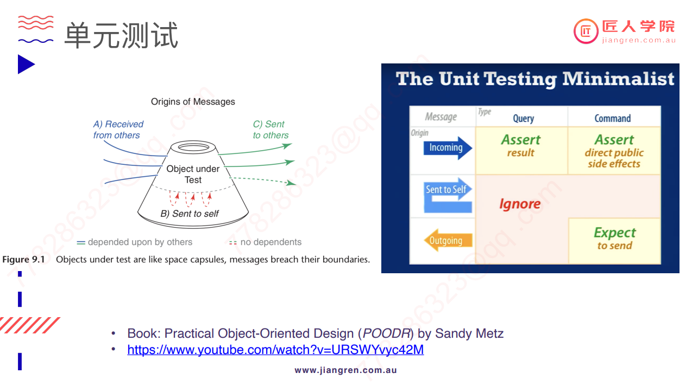
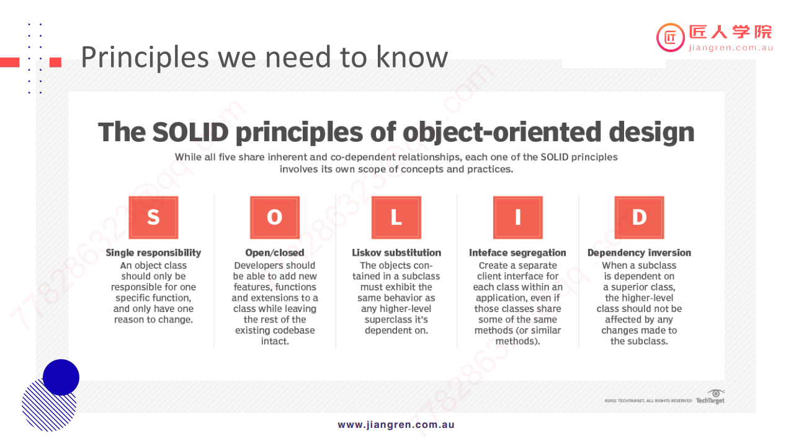

# Java_Part_2

## Table of Content

- [Exception handling](#exception-handling)
- [日志](#日志)
- [面向对象编程](#面向对象编程)
- [单元测试](#单元测试)

## Exception handling

### The Error Class and the Exception Class

- The **Error** class is used to indicate a serious problem that the application should *not* try to handle.
- The **Exception** class is used when there is a less catastrophic event that the application *should* try to handle.

### Throwable 类

- Throwable 类是整个 Java 异常体系的超类，所有异常类都是从这个类派生出来的。它包含 Error 和 Exception 两个直接子类。
  - Error 表示在运行期间出现的严重、不可恢复的错误，在这种情况下，应用程序只能中止运行，例如 JVM 错误。程序中不需要捕获 Error 类型的异常，通常也不应该抛出 Error 类型的异常。
  - Exception 是应用层面的顶层异常类，包括 RuntimeException（运行时异常）和 Checked Exception（受检异常）。

### 检查异常与未检查异常

**未经检查的异常**

- **未经检查**的异常是编译器未知的异常。
- 这些异常只在运行时才知道，因此也被称为*运行时异常*。
- 它们是编程错误的结果，通常是算术错误（例如除以 0）。
- 当我们期望方法的调用者无法从异常中恢复时，使用未经检查的异常。

> RuntimeException 是一种 Unchecked Exception，即编译器不会检查程序是否对 RuntimeException 进行了处理，程序中不必捕获 RuntimeException 类型的异常，也不必在方法体中声明抛出 RuntimeException 类。通常来说，RuntimeException 发生时，表示程序中存在编程错误，应当找出错误并修改程序，而不是捕获 RuntimeException。常见的 RuntimeException 有 NullPointException、ClassCastException、IllegalArgumentException、IndexOutOfBoundException 等。

**检查异常**

- **编译器知道**已检查的异常。
- 如果我们调用的方法可能会引发检查异常，则*必须*对其进行处理（否则编译器会报错）。
- 当我们期望方法的调用者*可以*从异常中恢复时，使用检查异常。

> Checked Exception 是相对于 Unchecked Exception 而言的，所有继承自 Exception 并且不是 RuntimeException 的异常都是 Checked Exception。JAVA 语言规定必须对 Checked Exception 进行处理，编译器会对此进行检查，要么在方法体中声明抛出 Checked Exception，要么使用 catch 语句捕获 Checked Exception 进行处理，否则不能通过编译。常用的 Checked Exception 有 IOException、ClassNotFoundException 等。

### 编写异常处理程序

要处理异常，我们需要编写一个**异常处理程序**。这涉及三个主要组成部分：

- 一块 `try` block
- 一块 `catch` block
- 一块 `finally` block

```java
try {
    read();
} catch (FileNotFoundException ex) {
    ex.getLocalizedMessage();
} finally {
}
```

注意：在实际工作项目中，异常处理一般占代码总量的 30% 甚至 40%。

### 原则性问题 - 异常处理机制初衷

1. 将不可预期异常的处理代码和正常的业务逻辑处理代码分离。
2. 异常只应用于处理非正常情况，不要用异常处理来代替正常流程控制（对于完全可预见的、处理方式清晰的错误，程序应提供相应的错误代码，而不是笼统称为异常）。
3. 先捕获小异常，再捕获大异常（Exception e 用于表示未知异常）。
4. 对于完全已知的错误，应编写处理这种错误的代码，以增加程序健壮性。

企业应用做法：程序先捕获原始异常，然后抛出一个新的业务异常，新的业务异常中包含对用户的提示信息。这种做法叫异常转译。核心是：在合适的层级处理异常。

## 日志

- 日志分为多个级别：
  - DEBUG：用于调试应用程序的最细粒度信息事件。
  - INFO：在粗粒度级别上突出显示应用程序进度的信息性消息。
  - WARN：表示可能有害的情况。
  - ERROR：表示可能仍允许应用程序继续运行的错误事件。
  - FATAL：表示可能导致应用程序中止的非常严重的错误事件。
- 在生产环境中，不要使用 System.out 作为日志工具。
- 使用 Log4j 或 logback。
- 使用日志配置。
- 建议使用 slf4j：slf4j 是一套包装 Logging 框架的接口程序，以外观模式实现。可以在软件部署时决定使用的 Logging 框架，目前主要支持的有 Java Logging API、log4j 及 logback 等框架。[了解更多](https://zh.wikipedia.org/wiki/SLF4J)

## 面向对象编程

### 继承

- **继承**是一个类从另一个类获取属性和方法。以下是您应记住的有关继承的一些关键点：
  - 从一般到具体。**父类**或**超类**是最通用的，**子类**是更具体的。
  - 通过**扩展**超类，声明子类属于*超类类型*。当我们不确定子类是否继承自父类时，可以使用“is a”测试（例如，汽车*是*车辆）。
  - 超类和子类之间的关系*只有一种方式*。子类需要知道超类，但超类不应该知道它的子类。

### Object 类

- 每个类都继承自超类 `Object`。因为所有对象都继承自 `Object` 类，所以所有对象都有一些方法，无论它们是什么类型。

### 多态

在 Java 中，可以使用任何类型的继承来支持多态。在我们的车辆示例中，每个车辆都有两种形式——例如，一个 `Car` 对象既是 `Car` 也是 `Vehicle`（因为它继承自 `Vehicle` 类）。因此，任何 `Car` 对象都有两种形式，这就是多态。

如果我们想获得所有 `Car`、`Boat` 和 `Plane` 对象的速度，我们可以很容易地做到这一点，因为多态——我们只需创建一个包含所有类型对象的列表 `Vehicle`，并获取每个 `Vehicle` 对象的速度，无论对象的其他类型是什么。

举例：

```java
// 创建一个大小为3的 Vehicle 类型的数组
Vehicle[] vehicles = new Vehicle[3];

// 实例化三个新对象并将它们添加到数组中。
// 看起来这些都是不同类型（Car、Plane 和 Boat），
// 但它们都继承自 Vehicle 类，因此除了子类的类型外，它们也是 Vehicle 对象。
vehicles[0] = new Car();
vehicles[1] = new Plane();
vehicles[2] = new Boat();

// 遍历数组并打印每个 Vehicle 对象的速度
for (int i = 0; i < vehicles.length; i++) {
    vehicles[i].speed();
}
```

### 抽象类

**抽象类**具有以下关键特征：

- 它定义了每个子类的行为，但我们不能直接实例化抽象类本身。
- 它允许我们创建**抽象方法**。
  - 抽象方法是不包含实现主体的方法。相反，它只是为该方法提供了一个头。
  - 扩展抽象类的子类需要覆盖所有抽象方法并提供具体实现。

**重要！** Functional Interfaces:

- An interface that has a single abstract method is called a functional interface.

举例：

```java
public class FunctionInterfaces {

    @FunctionalInterface
    public interface Foo {
        String method(String string);
    }

    private String add(String string, Foo foo) {
        return foo.method(string);
    }

    public String tryFunction() {
        Foo foo = parameter -> parameter + " from lambda";
        return add("Message", foo);
    }

    private boolean isPersonEligibleForVoting(Person person, Predicate<Person> predicate) {
        return predicate.test(person);
    }

    public void testPredicate() {
        Person person = new Person("Alex", 23);
        // 创建一个谓词。如果年龄大于18则返回 true。
        Predicate<Person> predicate = p -> p.age > 18;

        boolean eligible = isPersonEligibleForVoting(person, predicate);
        System.out.println("Person is eligible for voting: " + eligible);
    }

    public void tryFunctions() {
        Function<String, Integer> lengthFunction = str -> str.length();
        System.out.println("String length: " + lengthFunction.apply("This is awesome!!"));

        Function<Integer, Integer> increment = x -> x + 10;
        Function<Integer, Integer> multiply = y -> y * 2;

        // 使用 compose()，先进行乘法运算，然后再进行加法运算。
        System.out.println("compose result: " + increment.compose(multiply).apply(3));

        // 使用 andThen()，先进行加法运算，然后再进行乘法运算。
        System.out.println("andThen result: " + increment.andThen(multiply).apply(3));
    }

    public void tryBiFunction() {


        BiFunction<Integer, Integer, String> add = (a, b) -> String.valueOf(a + b);

        System.out.println("Sum = " + add.apply(2, 3));
    }

    class Person {
        String name;
        int age;

        Person(String name, int age) {
            this.name = name;
            this.age = age;
        }

        public int getAge() {
            return age;
        }

        public void setAge(int age) {
            this.age = age;
        }
    }
}
```

## 单元测试



