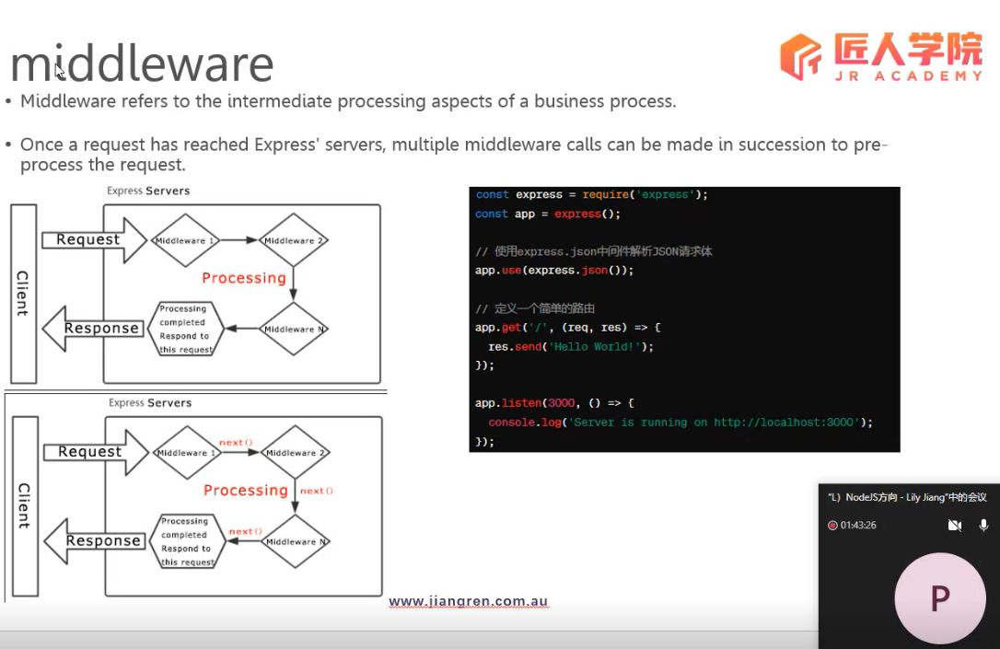
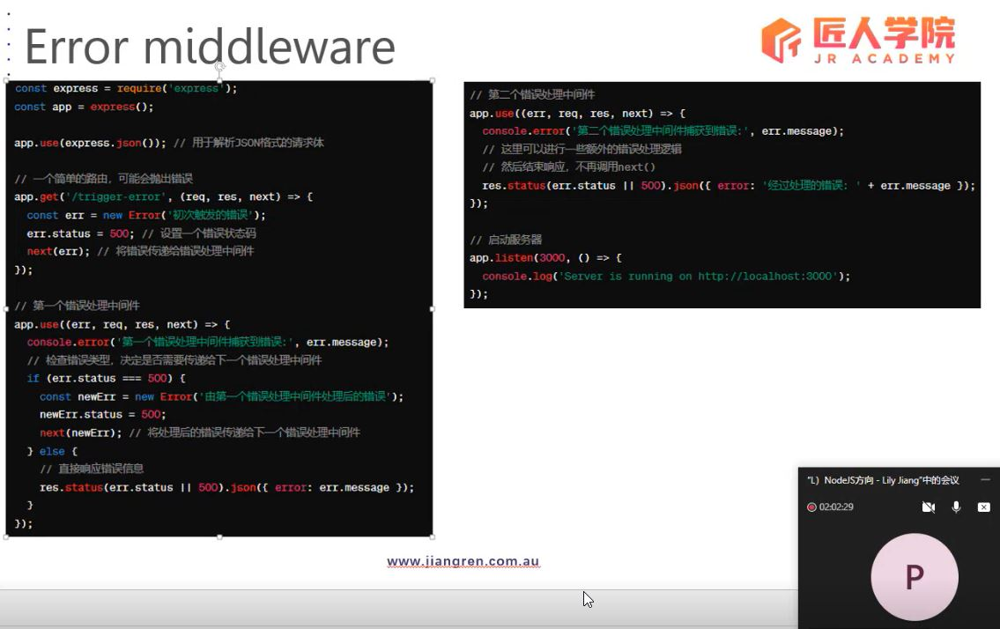
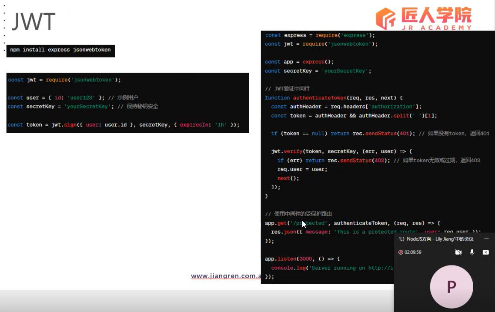

# Node Part 4

## Table of Content

- [API and RESTful API](#api-and-restful-api)
- [Node.js](#nodejs)
- [express.js](#expressjs)

## API and RESTful API

### API - Application Programming Interface

An API (Application Programming Interface) is a set of rules and protocols that define how software components or systems interact with each other. It encompasses various aspects such as:

- Function Calls and Parameter Passing: Other software components can invoke specific functions and pass parameters to perform particular operations.
- Data Formats and Protocols: APIs define how data is sent and received, along with the protocols and data formats used during interactions.
- Permissions and Security: APIs can specify access permissions and security measures to ensure that only authorized users can access and utilize the API.

### RESTful API - Representational State Transfer

- Resources: In REST, data is represented as resources, each with a unique identifier (typically a URI).
- Operations: Operations on resources are performed using standard HTTP methods like GET, POST, PUT, DELETE, etc.
- Stateless: RESTful APIs are stateless, meaning each request contains all the necessary information, and the server does not store information about client state. Each request should be independent.
- Uniform Interface: RESTful APIs use a uniform interface, including resource identifiers, methods for resource operations, resource representations, and hypermedia as the engine of application state.

### HTTP Protocol

URL - Uniform Resource Locator

- Scheme: Http, Https, FTP
- Host
- Port: 80（Http default port）, 443（Https default port）, 21（FTP default port）
- Path
- Query Parameters: `?key=value&key=value`

### HTTP Request and Response

Imaging ordering (request) and waiting for food (response and resource) in a resturant.

#### HTTP Request:

1. **Request Line**: Contains the HTTP method (e.g., GET, POST), the target URL, and the HTTP version.
2. **Headers**: Additional metadata about the request, including information like content type, user agent, and cookies.
3. **Body**: Data sent with the request, typically used with methods like POST or PUT to send form data or JSON payloads.

#### HTTP Response:

1. **Status Line**: Contains the HTTP version, status code (indicating success, failure, etc.), and a textual reason phrase.
2. **Headers**: Similar to request headers, these provide additional information about the response, such as content type, server information, and caching directives.
3. **Body**: Data returned in response to the request, commonly HTML, JSON, XML, or binary data for file downloads.

These components facilitate communication between clients and servers over the Hypertext Transfer Protocol (HTTP), enabling the exchange of information and resources on the web.

### REST

1. Statelessness

- Statelessness refers to the principle that each request from a client to the server must contain all the information necessary to understand and fulfill that request. The server should not rely on any past requests or sessions stored on the server itself.

2. Representation State Transfer

- Resources are represented in a format that is meaningful to both clients and servers. Clients can request representations of resources in different formats based on their needs, and servers can respond with the appropriate representation. This decoupling of resource state from its representation enhances flexibility and interoperability.

3. Uniform Interface

- The "Uniform Interface" constraint in REST architecture refers to a standardized way of interacting with resources within a system. This constraint ensures that all components of the system have a consistent and predictable way of communicating with each other. The uniform interface simplifies the architecture, promotes scalability, and enhances the interoperability of different components.

## Node.js

### built-in module

- file
- path
- http
- and others ...

### npm and packages

- Installing npm to manage packages and dependencies in Node.js projects
- Managing project dependencies by specifying them in the package.json file
- Using npm to update packages
- Publishing your own packages to npm registry with npm publish
- Exploring the npm ecosystem for a wide range of packages and modules for various purposes

## express.js

### Middleware



- Middleware functions in Express.js allow you to perform actions on requests before they reach the route handler or modify the response before it's sent back to the client.
- Common uses of middleware include logging, authentication, authorization, error handling, and parsing request bodies.
- Middleware functions can be added globally to all routes or specific to certain routes.
- They are executed in the order they are defined, and can either terminate the request-response cycle or pass control to the next middleware in the stack using next().

#### Error Handling Middleware



### Route

- Routes in Express.js define how your application responds to client requests at specific endpoints (URIs) and HTTP methods (GET, POST, PUT, DELETE, etc.).
- Each route can have one or more handler functions, which are executed when the route is matched.
- Routes are defined using app.get(), app.post(), app.put(), app.delete(), etc. methods, where app is an instance of the Express application.
- Route parameters can be defined in the URL pattern to capture dynamic values from the request URL.
- Express supports middleware at the route level, allowing you to apply middleware specific to certain routes.
  > 公司会有自己的框架，由架构师和 senior 一起编写，用于快速开发，包括
- 数据库连接
- 处理路由
- global error handling
- 统一返回

### Auth



### Install express.js

`npm install express`

### Create a server by express.js

```js
const express = require("express");

// Create an Express application
const app = express();

// Define a route
app.get("/", (req, res) => {
  // req 请求, res 响应
  res.send("Hello, world!");
});
```

### Listen to port

```js
const port = 3000;
app.listen(port, () => console.log("Server is running on port " + port));
```

### req

#### `req.query`

`req.query` is a property of the Express `Request` object that holds the query parameters sent in the URL. When a client sends a GET request to a server with query parameters, Express parses those parameters and makes them available in the `req.query` object.

For example, if you have a URL like this:

```txt
http://localhost:3000/?name=John&age=30
```

You can access the `name` and `age` parameters using `req.query`:

```javascript
app.get("/", (req, res) => {
  // Accessing query parameters
  const name = req.query.name;
  const age = req.query.age;

  res.send(`Name: ${name}, Age: ${age}`);
});
```

When you visit `http://localhost:3000/?name=John&age=30` in your browser, the server will respond with:

```txt
Name: John, Age: 30
```

`req.query` is particularly useful for extracting data from URLs in GET requests. It parses the query string and provides an object where each key is a query parameter name and its corresponding value is the parameter's value.

#### `req.params`

`req.params` is an object in Express.js that captures named route parameters in the URL. When you define a route with a parameterized pattern using placeholders (e.g., `/:id`), Express extracts the actual values from the URL and stores them in `req.params`.

For example, consider the following route definition:

```javascript
app.get("/user/:id", (req, res) => {
  const userId = req.params.id;
  res.send(`User ID: ${userId}`);
});
```

In this route, `:id` is a placeholder for a user ID. When a request is made to `/user/123`, Express extracts `123` from the URL and stores it in `req.params.id`. You can then use `req.params.id` to access this value within your route handler.

`req.params` allows you to create dynamic routes where different URLs can trigger the same route handler but with different parameter values. This is commonly used in RESTful APIs to handle resource identifiers such as user IDs, product IDs, etc.

### `app.use(express.static('public'))`

express.static is a built-in middleware function in Express.js used to serve static files, such as HTML, images, CSS, JavaScript, and other client-side assets.

In this example, the `express.static` middleware is configured to serve static files from the `public` directory. When a request is made to the server, Express first checks if the requested resource exists in the `public` directory. If it does, Express serves the file directly; if not, it proceeds to the next middleware or route handler.

Assuming you have a file named `example.html` in the `public` directory, you can access it in the browser using the URL `http://localhost:3000/example.html`.

Using `express.static` is a convenient way to serve static files in Express applications, making it easier to manage client-side assets.

### nodemon

```bash
npm install nodemon -D
```

By using Nodemon, you don't have to restart the server after making changes.
