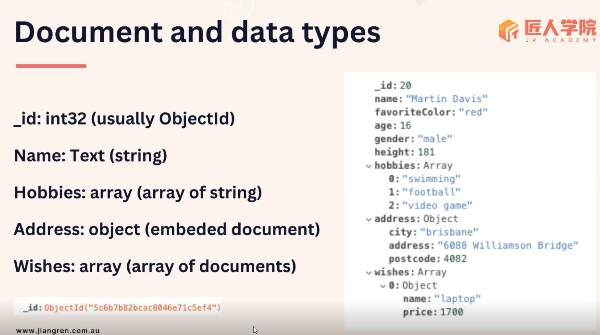
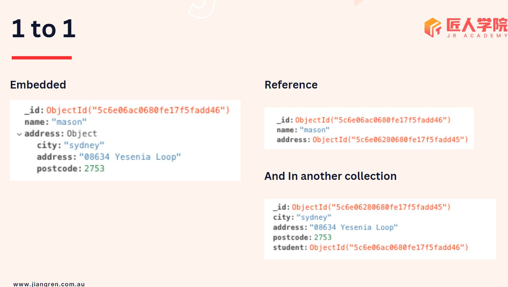
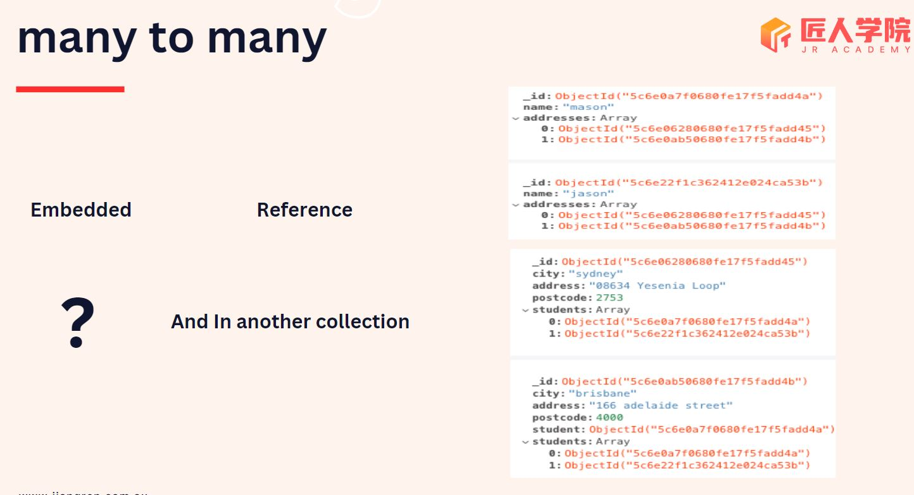

# Node Part 6

## Table of Content

- [MongoDB & Mongoose](#mongodb--mongoose)
  - [Different Types of Databases](#different-types-of-databases)
  - [MongoDB](#mongodb)
  - [Mongo shell command-line tools](#mongo-shell-command-line-tools)
  - [Relation](#relation)
  - [Database Optimization](#database-optimization)
  - [Mongoose](#mongoose)

## MongoDB & Mongoose

### Different Types of Databases

- SQL: Structured Query Language
  - Designed for relational databases such as PostgreSQL, MySQL, SQLite.
- NoSQL Database: Designed for non-relational databases
  - Categories:
    - Document-oriented: e.g., MongoDB
    - Key-value: e.g., Redis
      - Commonly used as a caching database, may coexist with MongoDB and SQL databases.
    - Graph-oriented: e.g., Neo4j
    - Column-family: e.g., Cassandra
  - Large-scale projects may utilize multiple databases, including both SQL and NoSQL databases tailored for different scenarios and data needs. In server architectures, each team may use its own microservices and databases, with various languages and frameworks.

### MongoDB

- No-SQL Database
- JSON-like(BSON) documents (key-value pair)
- Flexibility and Schemaless

#### MongoDB Terminology




- `_id` The only unique and mandatory field in MongoDB database
  - which by default generates a unique `ObjectId`.
- use CamelCase for field

### Mongo shell command-line tools

- It is an interactive command-line tool used to connect to the MongoDB server and perform various database CRUD operations.
- Why learn command-line tools
  - Because they might be used during pair coding.
- examples:
  - `show dbs`: show all database
  - `use school`
    - `school`: database name
  - `show collections`: show all collections
  - `school.students.insertOne({"name": "Mason"}) `
    - create one document
    - `students`: collection name
    - `insertOne()`: operation
    - `{"name": "Mason"}`: document
  - `school.students.insertMany([...]) `
    - create multiple documents
  - `school.students.find() `
    - read operation: all documents in students
    - There is a limit to querying data with find() in the shell.
    - In code, there is no limit, so adding filtering criteria or using pagination is necessary.
      - `school.students.find({name: "Json"}) `
    - The return value can be configured with parameters to control the fields returned, reducing network transfer and processing overhead, thus improving query efficiency. `projection`
      - `school.students.find({},{name: 1, _id: 0}) `
  - `school.students.findOne() `
    - Find one
  - `school.students.updateOne({},{$set:{}}) `
    - Two parameters
      - Filtering condition
      - $ operator + Updated value
    - example
      - `school.students.updateOne({name: "Jason"},{$set:{name: "Alice"}}) `
  - `school.students.updateMany({},{$set:{}}) `
    - update many
  - `school.students.replaceOne() `
    - replace one
  - `school.students.deleteOne({name: "Alice"}) `
    - delete one
  - `school.students.deleteMany({name: "Alice"}) `
    - delete many
  - `school.students.deleteMany()`
    - delete all
- Types of Operators
  - Query Operators
    - locate data
  - Projection Operators
    - presention of the data
  - Update Operators
    - modify data

### Relation

#### Different method to build relation

- Embedded
- Reference

#### Different type of relation

- 1 to 1
  
- 1 to many
  
  - Embedded
  ```json
  [
    {
      "_id": 1,
      "name": "xx",
      "addresses": [
        {
          "_id": 10,
          "city": "sydney",
          "postcode": 2001
        },
        {
          "_id": 11,
          "city": "brisbane",
          "postcode": 4000
        }
      ]
    },
    {
      "_id": 2,
      "name": "yy",
      "addresses": [
        {
          "_id": 10,
          "city": "sydney",
          "postcode": 2001
        },
        {
          "_id": 11,
          "city": "brisbane",
          "postcode": 4000
        }
      ]
    }
  ]
  ```
  - Reference
  ```json
  [
    {
      _id: 1,
      name: "xx",
      addresses: [
        _id: 10,
        _id: 11
      ]
    },
    {
      _id: 2,
      name: "yy",
      addresses: [
        _id: 10,
        _id: 11
      ]
    }
  ]
  ```
- Many to many
  

#### Advanced Relation Thoughts

- Bi-directional referencing vs parent reference or child reference
- Normalization vs Denormalization(good for read but not for write)
- one to millions relationship (use parent reference or child reference)
  > mongodb document size limit: 16mb

#### Tips

- Do embedded if you can (especially one to one),
  - but have to consider
    - if this relation will become one to many in the future,
    - will this data need to be access independently
- One to couple(less than 10), consider array of embedded docs
- One to many, consider array of references
- One to million, consider parent-reference or child reference
- If read query is much more than write query, go denormalize

### Database Optimization

1. index，targeting a specific field
   - like a tabel of content for a book，help to search
   - Requires additional space and time
   - Adding indexes doesn't always guarantee improved efficiency
2. aggregate pipeline
   - Just like middleware, you can add multiple pipes, with the most data-intensive processing placed at the forefront for optimal efficiency.
     - It affects the performance of the database.
     - It is suitable for requests with low frequency, where request limits can be set or caching can be added.
3. Database Refactoring
4. Database Migration

#### Transactions

- Ensuring changes to two pieces of data occur together
  - For sensitive and important data, for example bank transfers
  - Large-scale projects with high request volumes require transactions
  - Transactions are supported in the cloud in production period, but local databases might not support them during development period

### Mongoose

- A ORM (object relational mapper) or ODM (object data mapping)
- Schema
  - Defines the structure of collections/documents in a database.
  - Specifies the fields, their types, and validation rules for each document.
  - Ensures consistency and provides data validation and formatting.
  - Helps in organizing and managing data efficiently.
- Model
  - Represents a class used to interact with the database.
  - Typically maps to a specific collection/table in the database.
  - Provides methods for CRUD operations (Create, Read, Update, Delete) on documents.
  - Includes logic for defining document structure, data validation, and querying.
